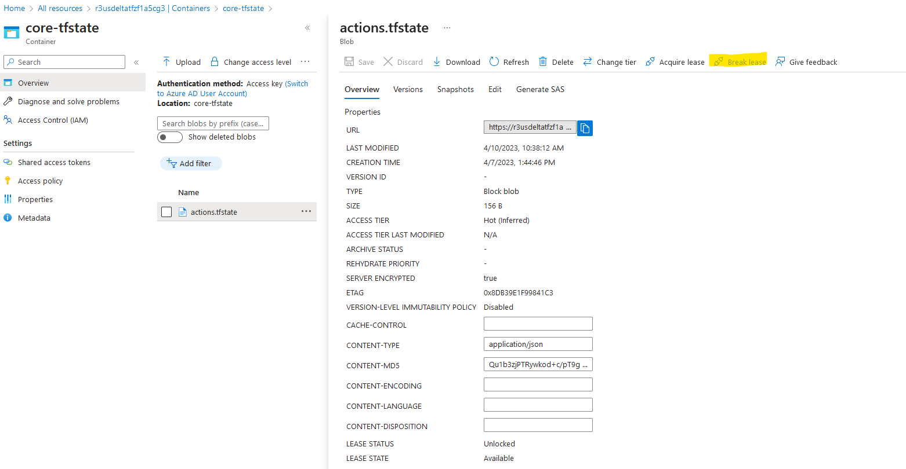

# REB3Azure Repository
This repository stands in contrast to the REB4Modules and REB4<Client> repositories in that REB3Azure is a monolithic repository.
As such, the REB3Azure Repository has all the module library and client information along with the necessary workflows, although I'm not making any claim as to how easy it will be to just schedule a workflow for only one client.

## Rationale for implementing both, a monolithic and a multi-repo
I have looked at the monorepo layout and the polyrepo layout also called multi-repo layout and their advantages and drawbacks and consulted the write-up at https://earthly.dev/blog/monorepo-vs-polyrepo/

Because of the impact that the decision of the repository structure has on releases, issue-tracking, permissions, and secrets, I have decided for implementing both, to personally explore issues related to issue tracking and workflow management.

## Workflows
The idea of the poly-repo structure is that each spoke repository can have its own workflow and deployments are made based on triggering events such as a push or a pull-request in a spoke repository. With respect to issue tracking and understanding the impact of commits to the repository, the poly-repo is at an advantage when a larger team is at work at the same time. We also need to be able to trigger the workflows in the spoke repository if a triggering event occurs in the hub repository. GitHub does not natively support the execution of workflow b in repository B if a push in repository A happens causing a workflow a. This can be accomplished by running cron events in the spoke repositories checking for changes in releases in the hub repository.

### Mono-Repo
In the mono-repo, the scheduling of a workflow for all clients upon a change to a library function is trivial since the use of actions/checkout will deploy the entire repository code on the runners' file system and we can then easily call a reusable workflow to handle each client in turn. The workflow will look like:
```
name: Dev-Deploy-All
on:  
  workflow_dispatch:
jobs:
  delta:
    name: Deploy Delta
  # this is a reusable workflow with input parameters!
    uses: ./.github/workflows/deploy.yml
    with:
      environment: Development
      working-folder: r3dev-delta
    secrets:
      inherit
 ..
 ..
 ..
  zeta:
    name: Deploy Epsilon
    uses: ./.github/workflows/deploy.yml
    with:
      environment: Development
      working-folder: r3dev-zeta
    secrets:
      inherit      
```
and such, the reusable workflow is doing all the work. Yes, this will result in multiple downloads of the repository to the runner(s) which I don't know how to avoid if possible:

```
name: Reusable Deploy
on: 
  workflow_call:
    inputs:
      environment:
        description: "Environment context in which to run the Terraform process."
        required: true    
        type: string
      working-folder:
        description: The name of the client folder to process
        required: true
        type: string

jobs:
  Terraform:
    name: Terraform deploy ${{ inputs.environment }}
    runs-on: ubuntu-latest
    environment: ${{ inputs.environment }}
  
    # these are the secrets based on the environment!
    env:
      ARM_CLIENT_ID: ${{ secrets.ARM_CLIENT_ID }}
      ARM_CLIENT_SECRET: ${{ secrets.ARM_CLIENT_SECRET }}
      ARM_TENANT_ID: ${{ secrets.ARM_TENANT_ID }}
      ARM_SUBSCRIPTION_ID: ${{ secrets.ARM_SUBSCRIPTION_ID }}    

    defaults:
      run:
        shell: bash
        working-directory: ${{ inputs.working-folder }}

    steps:
      - name: Get Repository Code
        uses: actions/checkout@v3
      # Install the preferred version of Terraform CLI 
      - name: Setup Terraform
        uses: hashicorp/setup-terraform@v2
        with:
          terraform_version: 1.1.7
      # Initialize a new or existing Terraform working directory by creating initial files, loading any remote state, downloading modules, etc.
      - name: Terraform Init   
        run: terraform init 
      # Run a terraform apply 
      - name: Terraform apply
        id: plan
        run: terraform apply -auto-approve
```
### Multi-Repo

For the hub and spoke repository structure as in REB4Modules and REB4<Client> combination, I have currently decided to delay the introduction of a cron job and to create a general workflow for the REB4Modules repository causing the build for each spoke repository by scheduling a build job for each spoke repository via the following steps for each spoke while downloading the spoke repository in a separate folder. Note that this has implications as to how modules are referenced in either of the chosen repository configurations and it is advisable to understand the structure of the result on the runners' file system to avoid troubles:

```
delta:
    runs-on: ubuntu-latest
    steps:
    # The order of checkouts is important because of cleaning and the step afterwards will not find anything
    # unless there is a specific path specified!

    # Checkout client files to root folder
      - name: Checkout Client
        uses: actions/checkout@v3
        with:
          repository: WolfgangBaeck/REB4Delta

      # Checkout the module repository to separate folder protecting root file system    
      - name: Checkout Modules
        uses: actions/checkout@v3
        with:
          repository: WolfgangBaeck/REB4Modules
          path: modules

      - name: Show FileSystem
        run: ls -R

      - name: Run Terraform Action
        uses: ./modules/.github/actions/terraformdeploy
```
The code section above will be repeated for each spoke repository that is coded in the workflow yaml file in the REB4Modules repository.

## Reusable actions
Since we need to run the deployment for each client separately either in parallel or in sequence depending on our desire and the ability of Azure to cope with it, it is meaningful to embed the repetitive Terraform actions in its own action.yml file to be called for each job. This happens in the code above at the line of:

```
name: Run Terraform Action
 uses: ./modules/.github/actions/terraformdeploy
```
because the modules repository is checked out to the folder ./modules and not the root folder on the runner, we need to refer to the modules folder when calling the reusable (composite) action.

## Environment variables and secrets
Currently, the workflow in the REB4Module repository is making use of environment variables for the entire workflow like so:

```
name: Deploy All
on:
  workflow_dispatch:
env:
  ARM_CLIENT_ID: ${{ secrets.ARM_CLIENT_ID }}
  ARM_CLIENT_SECRET: ${{ secrets.ARM_CLIENT_SECRET }}
  ARM_TENANT_ID: ${{ secrets.ARM_TENANT_ID }}
  ARM_SUBSCRIPTION_ID: ${{ secrets.ARM_SUBSCRIPTION_ID }}
jobs:
  Delta:
  ...
  Epsilon:
  ...
  ...
  Walm
```
This implies that all the workflow jobs share the same secrets. If this isn't appropriate because we want to have different subscription ids for each client repository which is trivial to set in each client repository and the respective workflow, we will now have to employ job specific secrets in the REB4Module repository:
```
name: Deploy All
on:
  workflow_dispatch:
jobs:
  Delta:
    env:
        ARM_CLIENT_ID: ${{ secrets.Delta_ARM_CLIENT_ID }}
        ARM_CLIENT_SECRET: ${{ secrets.Delta_ARM_CLIENT_SECRET }}
        ARM_TENANT_ID: ${{ secrets.Delta_ARM_TENANT_ID }}
        ARM_SUBSCRIPTION_ID: ${{ secrets.Delta_ARM_SUBSCRIPTION_ID }}
  ...
  Epsilon:
    env:
        ARM_CLIENT_ID: ${{ secrets.Epsilon_ARM_CLIENT_ID }}
        ARM_CLIENT_SECRET: ${{ secrets.Epsilon_ARM_CLIENT_SECRET }}
        ARM_TENANT_ID: ${{ secrets.Epsilon_ARM_TENANT_ID }}
        ARM_SUBSCRIPTION_ID: ${{ secrets.Epsilon_ARM_SUBSCRIPTION_ID }}
  ...
  ...
  Walm
```
It is obvious that this can result in a number of problems since we have the information now in more than one place. While this seems to be a disadvantage for a multi-repo situation where from the hub we want to schedule the spokes, it isn't any different for the monolitic repository since the only difference between environment secrets can be at the "environment" level such as "Prod", "Dev", "UAT" and not on a per folder basis where each folder stands for a different client.
# Spoke Repository or additional Client Folders
Spoke repositories are all those that utilize the REB4Module repository to implement the Terraform code necessary for a complete client deployment. Examples are REB4Walm and REB4Kroger for example. Spoke repositories have their own deployment and destroy definitions as well as their own set of secrets holding the necessary information for tenent, client, subscription, and secrets which must be kept in synch with the REB4Module secrets if the intent to run all spoke deployments automatically upon a deployment in the REB4Module repository.
## Spoke Repository Creation
When creating a repository for a new client, several steps have to be completed in the right order:
1. Creating the client repository and uploading the terraform code for the client
2. Adding the secrets for the action workflow to the repository, typically tenantid, clientid, clientsecret, subscriptionid.
3. Creating the backend Terraform state repository as an Azure storage account. The creation of the state storage account presents us with a chicken - egg problem and will therefore most like stay a separate terraform or powershell script.
4. Updating the client's provider.tf file with the appropriate storage account information.

## Additional Client folder for Mono-Repository
  
When a new client needs to be on-boarded, we will need to create an additional client folder in REB3Azure by duplicating all that exists in an existing client folder but we need to update the provider.tf file accordingly. I have currently created a StateAccount terraform application that creates one account and a container for each client:
  
```
terraform {
    backend "azurerm" {
    resource_group_name  = "terraform-tfstate-rg"
    storage_account_name = "terraformtfv78lno1s"
    container_name       = "walm-tfstate"
    key                  = "actions.tfstate"
  }
  required_providers {
    azurerm = {
      source = "hashicorp/azurerm"
      version = "3.46.0"
    }
  }
}
```
## Statefile Lock Conflict Resolution
The terraform state for each client is currently maintained in an Azure storage account unless and until we may move to Terraform Cloud. The storage account is not required to be in the same subscription as the client subscription, just the name needs to be globally unique all lower case, no special characters, no spaces. 
The naming for the resource group is currently r3us<clientname>-tfstate-rg.
The Azure storage account has a blob container on a per client basis named <client>-tfstate and the blob is named actions.tfstate. The Terraform creation script is:
```
# Generate a random storage name
resource "random_string" "tf-name" {
  length = 8
  upper = false
  numeric = true
  lower = true
  special = false
}
# Create a Resource Group for the Terraform State File
resource "azurerm_resource_group" "state-rg" {
  name = "terraform-tfstate-rg"
  location = var.location
  
  lifecycle {
    prevent_destroy = true
  }  
  tags = {
    client = var.client
  }
}
# Create a Storage Account for the Terraform State File
resource "azurerm_storage_account" "state-sta" {
  depends_on = [azurerm_resource_group.state-rg]  
  name = "terraformtf${random_string.tf-name.result}"
  resource_group_name = azurerm_resource_group.state-rg.name
  location = azurerm_resource_group.state-rg.location
  account_kind = "StorageV2"
  account_tier = "Standard"
  access_tier = "Hot"
  account_replication_type = "ZRS"
  enable_https_traffic_only = true
   
  lifecycle {
    prevent_destroy = true
  }  
  
  tags = {
    name = "terraform"
  }
}

locals {
  clients = ["delta","epsilon","zeta","ahld","albt","brcp","gmi","harr","krog","prc","srai","stgalbt","stgsams","walm","weis","wmdp"]
}
# Create a Storage Container for the State File
resource "azurerm_storage_container" "core-container" {
  for_each = toset(local.clients)
  depends_on = [azurerm_storage_account.state-sta]  
  name = "${each.value}-tfstate"
  storage_account_name = azurerm_storage_account.state-sta.name
}
```
When the state file has the "LEASE STATUS" of "unlocked" a Terraform process can run and require the exclusive lock on this state file. If the state is "locked" then either a process is currently running or a process may have been deleted and therefore wasn't able to release the lock. In that case, one needs to go to the container and break the lease:



# State Separation for Environments (Prod, Test, Dev)
It seems that the coolest term currently floating in the area of handling multiple environments is "Keep your code DRY". It's an odd way of saying what every seasoned software developer knows as "One fact in one place only", especially the DB guys and here it means "Do not repeat yourself".

GitHub Actions supports this by providing the user with the idea of Environments and if the repository has a good structure suchas as stated here: (https://faun.pub/the-best-way-to-structure-your-terraform-projects-3f56b6440dcb) GitHub will greatly support you and you may not even need a replacement-token approach.
The replacement-token approach may be necessary if you need to replace placeholder tokens in .tfvars (and perhaps provider.tf) files since variables in .tfvars files cannot be substituted at Terraform apply time from the variables.tf file, one can only provide different variables.tfvar files at apply and plan time.

In the spoke or client repositories (REB4Delta, REB4Walm, etc.) I have specified environments for Production, Development, and UAT and for each environment in each client repository stored the necessary variables used for running Terraform such as ARM_CLIENT_ID, ARM_CLIENT_SECRET, ARM_TENANT_ID, and ARM_SUBSCRIPTION_ID.
Based on the general reading and limited experience with our setup, I have for each client the following setup:
```
REB4<client>
.github/workflows
--dev-deploy.yml
-=dev-destroy.yml
--prod-deploy.yml
--prod-destroy.yml
--uat-deploy.yml
--uat.destroy.yml
main.tf
provider.tf
output.tf
variables.tf
```
The same concept applies to the mono-repository and I haven't provided all workflows yet. The major difference in the mono-repository is that I have used reusable workflows instead of a composite workflow action just to play with the different approach.
  
In all client workflow yaml files composite workflows are called from the central module repository REB4Modules in this way:
```
    - name: Run Terraform Deploy Action
      uses: ./modules/.github/actions/terraformdeploy
```
and reusable workflow are colled:
  
```
    zeta:
    name: Deploy Zeta
    uses: ./.github/workflows/deploy.yml
    with:
      environment: Development
      working-folder: r3dev-zeta
    secrets:
      inherit
```
  I hope this helps!
